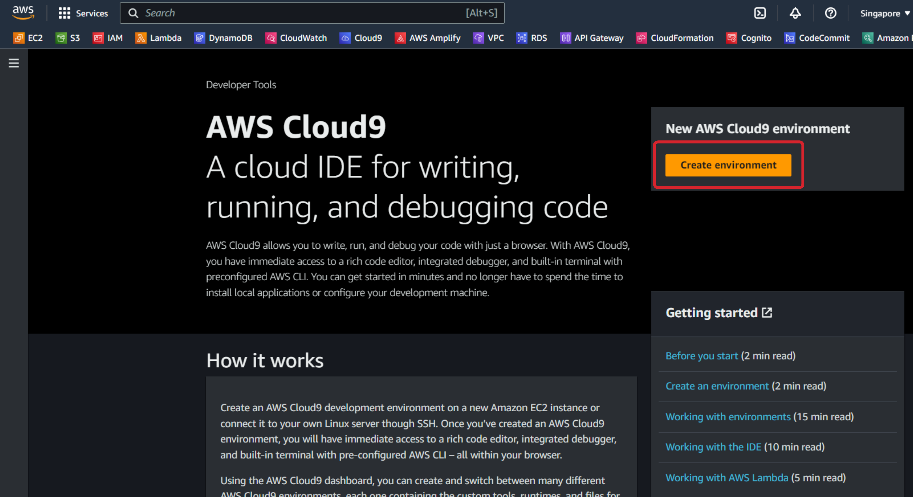
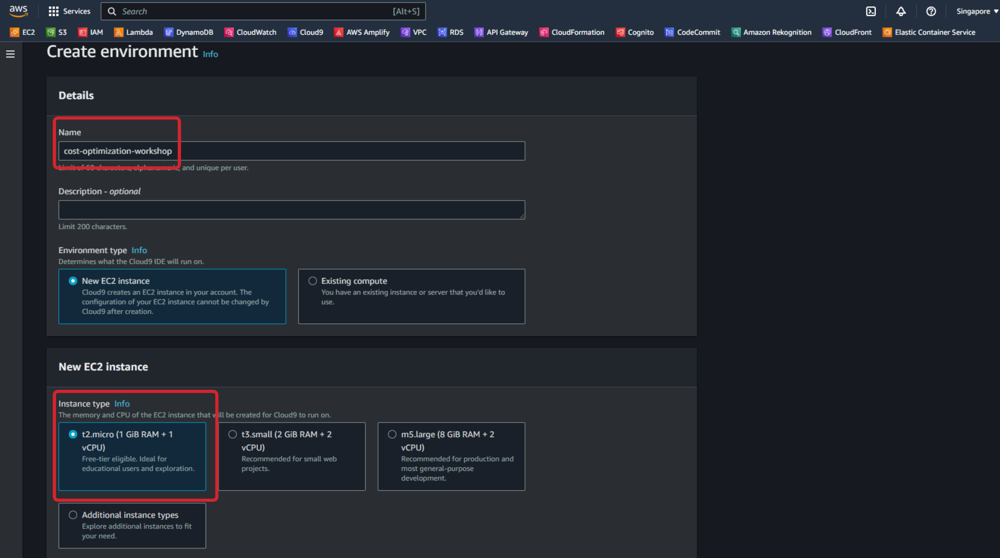
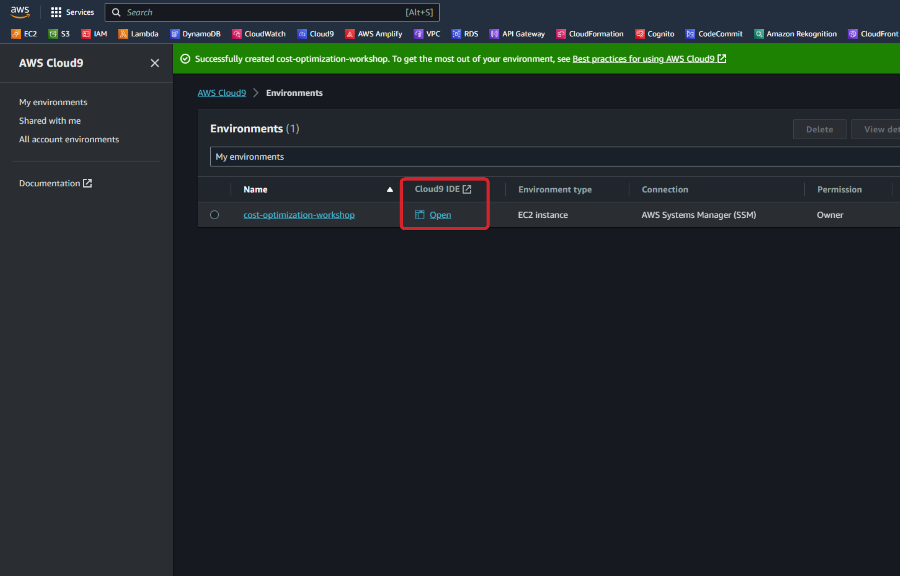
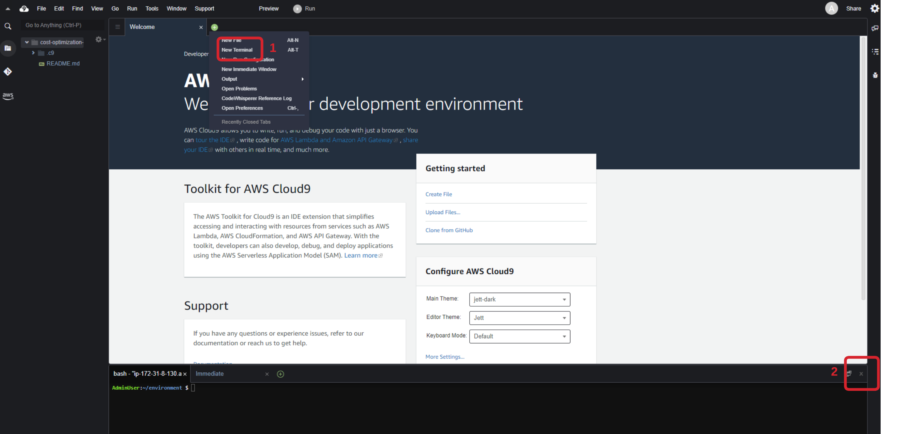
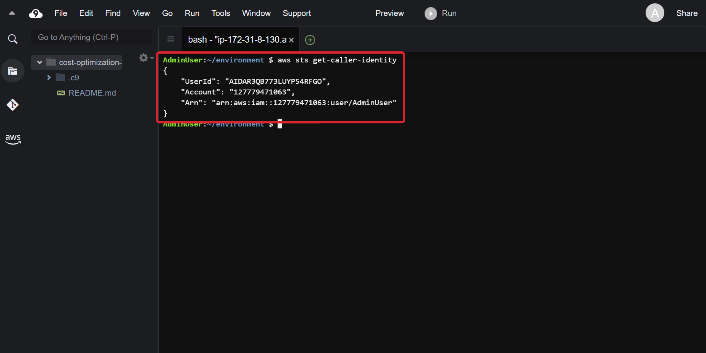
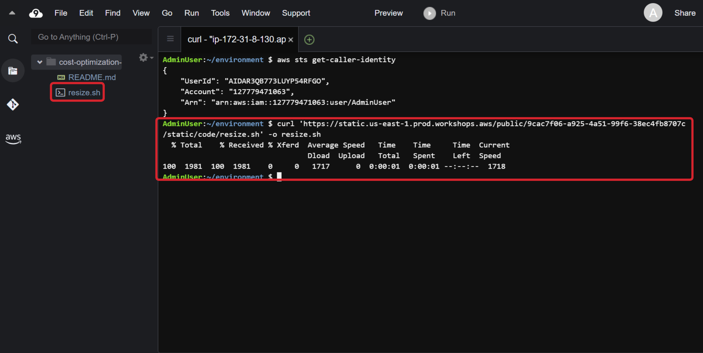
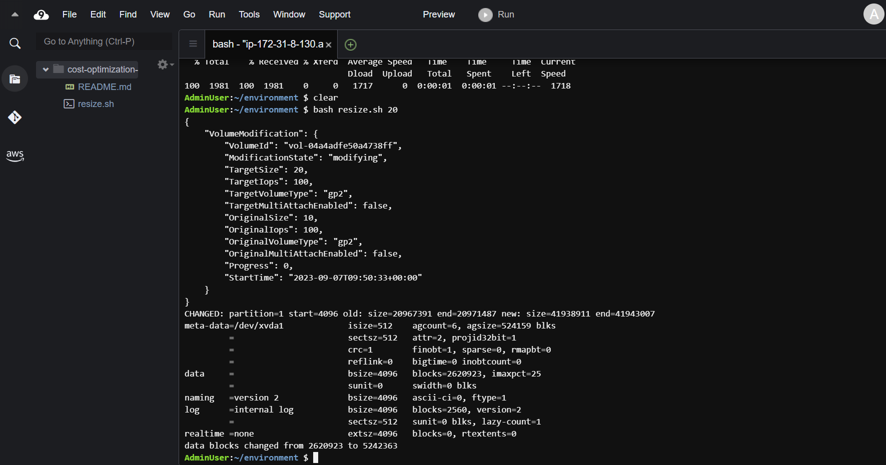

#### Chọn Region

Chúng ta chỉ sử dụng một region trong suốt buổi workshop và trong bài workshop này, chúng ta sẽ sử dụng **ap-southeast-1 (Asia Pacific - Singapore)**.

{}
Các bạn có thể chọn region khác tùy thuộc vào địa điểm bạn thực hiện bài workshop này để nhận được sự phản hồi nhanh chóng hơn.
{}

#### Khởi tạo AWS Cloud9 IDE

[AWS Cloud9](https://aws.amazon.com/cloud9/) là một môi trường phát triển tích hợp (IDE) dựa trên cloud cho phép cac bạn viết, chạy, debug code trên trình duyệt. Nó bao gồm code editor, debugger và terminal. **Cloud9** được đóng gói sẵn trong các công cụ cần thiết cho các ngôn ngữ lập trình phổ biến và **AWS Command Line Interface (CLI)** được cài đặt sẵn nên bạn không cần phải cài đặt file, cấu hình cho thiết bị mà các bạn đang dùng. 

Môi trường **Cloud9** của bạn sẽ có quyền truy cập vào cùng resource AWS như là người dùng mà bạn đã đăng nhập vào AWS Management Console.

#### Setup Cloud9

Sau khi đăng nhập vào AWS Management Console với account của bạn, hãy vào [Cloud9 console](https://ap-southeast-1.console.aws.amazon.com/cloud9control/home?region=ap-southeast-1#/product). Click vào nút **Create environment**. 



Tiếp theo, các bạn nhập `cost-optimization-workshop` cho giá trị của **Name**, các bạn chọn tạo mới EC2 ở phần **Environment type** với **Instance type** là **t2.micro**. Còn lại sẽ để mặc định, cuối cùng click vào nút **Create**.



Sẽ mất vài phút để đợi Cloud9 Environment được tạo xong.

#### Setup Cloud9 IDE

Khi Cloud9 IDE được tạo thành công, các bạn click vào nút **Open** như trên màn hình.



Và chúng giao diện của Cloud9 IDE được mở ra, hãy tắt tab Welcome, tắt terminal được khởi tạo sẵn và mở tab terminal mới.



Bây giờ bạn có thể chạy các lệnh **AWS CLI** trên terminal của Cloud9 IDE mà ko cần phải cài đặt lại. Hãy luôn mở **AWS Cloud9 IDE** trên trình duyệt trong suốt buổi workshop này.

Tiếp theo các bạn cần xác thực lại account hiện tại đang truy cập vào Cloud9 IDE này cách dán câu lệnh sau vào terminal vừa được tạo **aws sts get-caller-indentity** và nhấn Enter. Các bạn sẽ thấy output như hình dưới đây.



#### Resize Cloud9 Environment

Trước khi bắt đầu đi vào thực hiện, các bạn cần resize lại storage hiện tại bằng cách chạy câu lệnh dưới đây ở Cloud9 terminal. Đầu tiên chúng ta cần download file resize.sh từ đường dẫn dưới đây bằng lệnh **curl**. 

```
curl 'https://static.us-east-1.prod.workshops.aws/public/9cac7f06-a925-4a51-99f6-38ec4fb8707c/static/code/resize.sh' -o resize.sh
```

Khi download thành công, chúng ta sẽ nhận được như hình dưới đây.



Bây giờ chúng ta sẽ chạy file script **resize.sh** bằng câu lệnh **bash**.

```
bash resize.sh 20
```

Và chúng ta sẽ nhận được kết quả như hình sau khi resize thành công.



{}
Để đọc và hiểu thêm về resize.sh script, các bạn hãy truy cập tài liệu tài đây [Cloud9 documentation](https://docs.aws.amazon.com/cloud9/latest/user-guide/move-environment.html#move-environment-resize) 
{}


