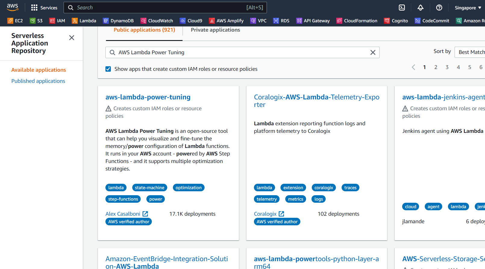
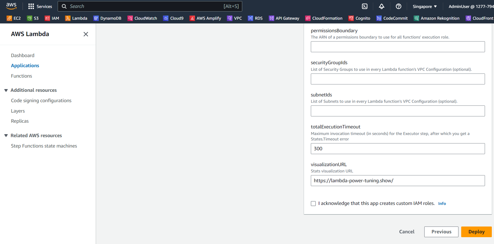
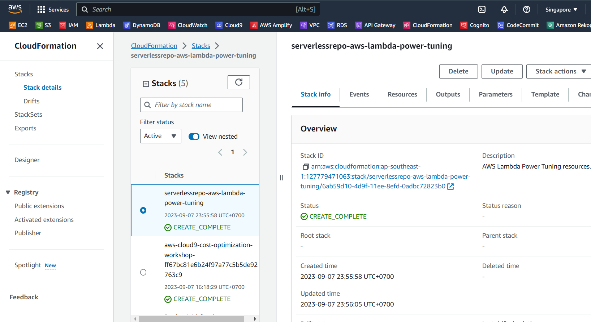

Lambda Power Tuning Tool được lưu trữ ở [Serverless Application Repository](https://aws.amazon.com/serverless/serverlessrepo/). SAR cho phép customers nhanh chóng publish và deploy ứng dụng Serverless. Customer có thể cấu hình quyền của SAR để cho phép truy cập vào các account cụ thể, account trong một tổ chức hoặc quyền truy cập công khai để có khả năng khởi chạy ứng dụng.

#### Khởi chạy Lambda Power Tuning Tool

Đầu tiên, các bạn hãy truy cập vào [Serverless Application Repository](https://console.aws.amazon.com/serverlessrepo). Ở thanh bên trái, chọn **Available applications**. Trên phần tìm kiếm ứng dụng, các bạn hãy nhập `AWS Lambda Power Tuning` ở mục **Public applications** và chọn vào **Show apps that create custom IAM roles or resource policies**. Sau đó chọn ứng dụng **aws-lambda-power-tuning**.

Ở trang **Review, configure and deploy**, chúng ta để mặc định các thông số, chọn vào **I acknowledge that this app creates custom IAM roles** và click vào nút **Deploy** ở cuối trang.

 

Chờ vài phút sau khi ứng dụng được deploy, chúng ta sang [CloudFormation Console](https://console.aws.amazon.com/cloudformation) để kiểm tra xem ứng dụng đã cài đặt thành công hay chưa.

