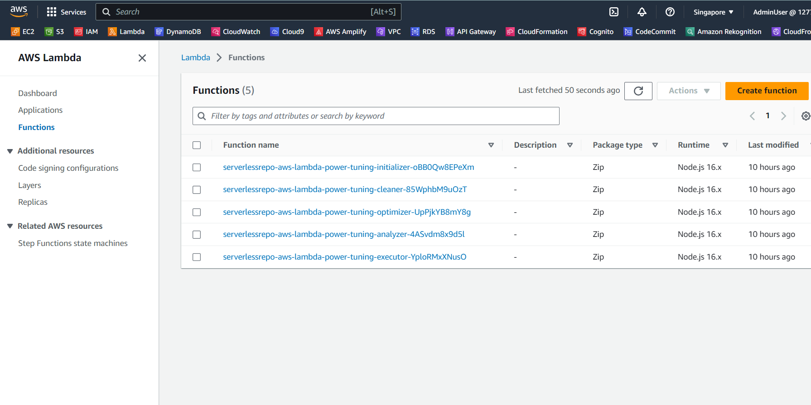
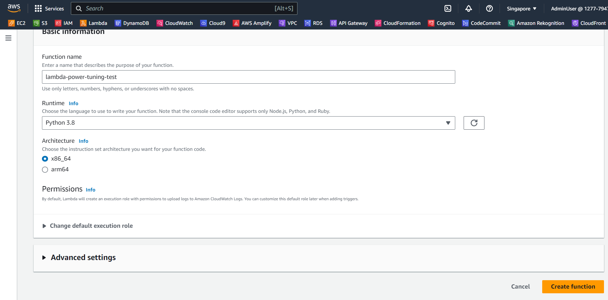
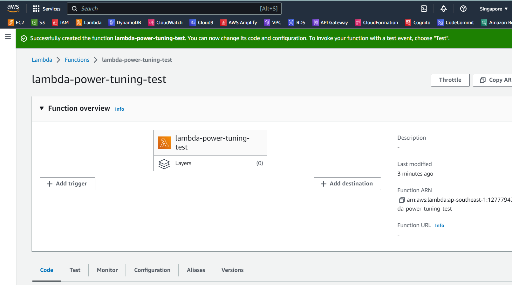
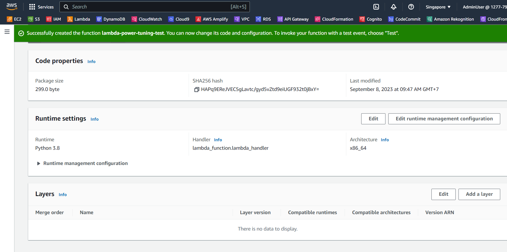
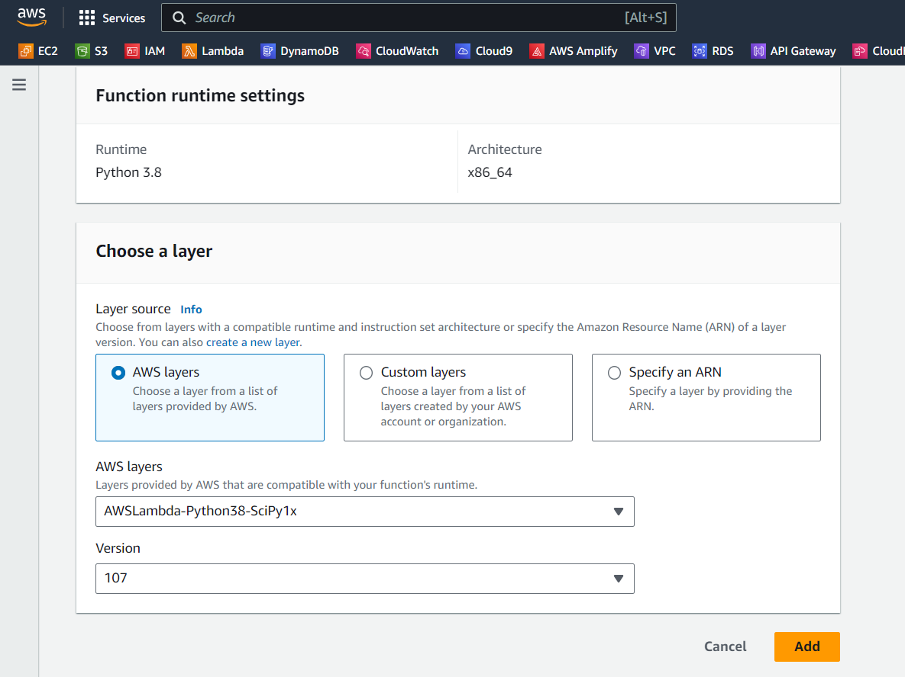
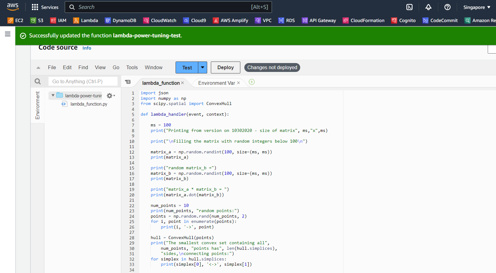
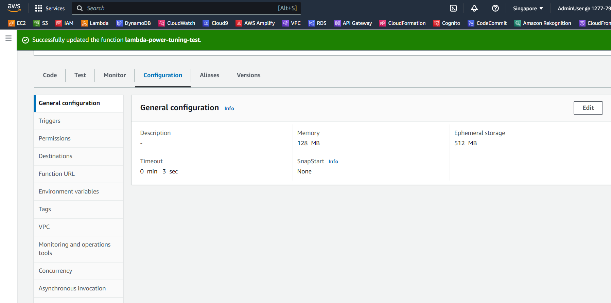
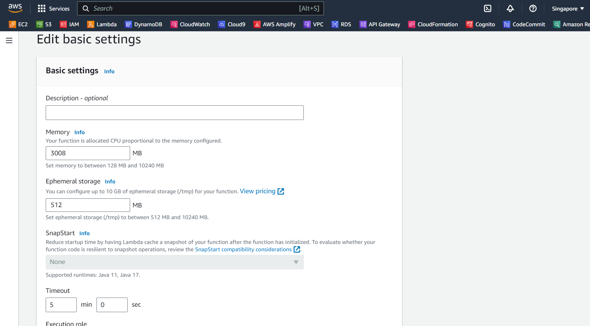
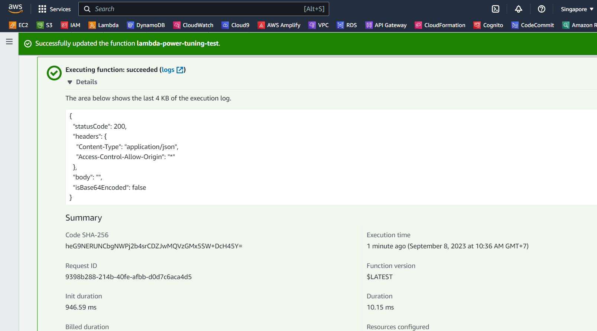
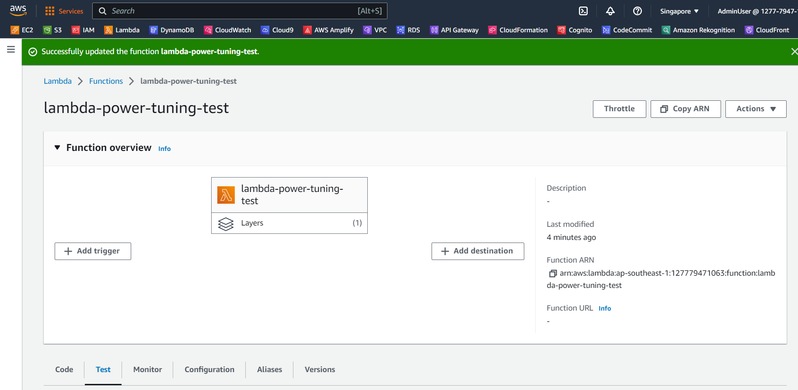

Bây giờ bạn đã cài đặt xong power tuning tool, bước tiếp theo là chạy AWS Lambda function dựa trên tool đó. Trong phần này, bạn sẽ deploy Lambda function để kiểm tra việc sử dụng Power Tuning Tool. Function này tốn nhiều bộ nhớ, sử dụng matrices.

#### Deploy the function

{}
Hãy đảm bảo rằng bạn đang deploy function này ở cùng region mà bạn đã cài đặt Lambda Power Tuning Tool
{}

Đầu tiên, bạn hãy vào [AWS Lambda Console](https://console.aws.amazon.com/lambda), nhìn vào thanh bên trái và chọn **Functions**. Click vào nút **Create function**.



Ở trang **Create function**, hãy chọn **Author from scratch**, đặt tên cho **Function name** là `lambda-power-tuning-test`. Chọn **Runtime** là **Python 3.8** và **Architecture** là **x86_64**, còn lại sẽ để mặc định. Cuối cùng, click vào nút **Create function** ở cuối trang.



Chờ giây lát, khi function được tạo ra, các bạn sẽ được điều hướng đến function đó. Ở mục **Function overview**, click vào **Layers**, nó sẽ chuyển ta xuống cuối trang ở phần **Layers**.



Click vào nút **Add a layer** ở góc phải.



Ở trang **Add layer**, các bạn chọn **AWS layers** cho phần mục **Layer source**. Ở phần **AWS layers**, hãy chọn **AWSLambda-Python38-SciPy1x** và **Version** mới nhất ở thời điểm bạn tạo. Cuối cùng, click vào nút **Add** ở cuối trang. 



Chờ giây lát khi layer mới được thêm vào Lambda function, chúng ta xuống dưới mục **Code** và copy đoạn code dưới đây và paste vào file **lambda_function.py**.


```
import json
import numpy as np
from scipy.spatial import ConvexHull

def lambda_handler(event, context):

    ms = 100
    print("Printing from version on 10302020 - size of matrix", ms,"x",ms)

    print("\nFilling the matrix with random integers below 100\n")

    matrix_a = np.random.randint(100, size=(ms, ms))
    print(matrix_a)

    print("random matrix_b =")
    matrix_b = np.random.randint(100, size=(ms, ms))
    print(matrix_b)

    print("matrix_a * matrix_b = ")
    print(matrix_a.dot(matrix_b))

    num_points = 10
    print(num_points, "random points:")
    points = np.random.rand(num_points, 2)
    for i, point in enumerate(points):
        print(i, '->', point)

    hull = ConvexHull(points)
    print("The smallest convex set containing all",
        num_points, "points has", len(hull.simplices),
        "sides,\nconnecting points:")
    for simplex in hull.simplices:
        print(simplex[0], '<->', simplex[1])

    return {
        'statusCode': 200,
        'headers': {
            'Content-Type': 'application/json',
            'Access-Control-Allow-Origin': '*'
        },
        'body': '',
        "isBase64Encoded": False
    }
```

Python Lambda function này sẽ generate ra random data và perform operation của nó. Nó được dùng cho experimentation và testing. Bây giờ hãy cùng xem vai trò của từng đoạn code:

**1. Import Statements**: Đoạn code bắt đầu bằng cách import những thư viện cần thiết:
- **json**: Thư viện này cho phép chúng ta sử dụng và làm việc với JSON data.
- **numpy (np alias)**: NumPy là thư viện cho những phép tính số trong Python
- **ConvexHull** from **scipy.spatial**:  Thư viện này cung cấp các function cho computing convex hulls, một khái niệm cơ bản trong computional geometry.

**2. lambda_handler Function**: Đây là function chính được thực thi khi Lambda function được trigger.
- **ms** được set giá trị 100, đại diện cho size của matrix được generate.
- Nó in ra size của matrix.

**3. Generating and Printing Random Matrices**:
- Hai random matrices, **matrix_a** và **matrix_b**, của size **ms x ms** được generate với giá trị số nguyên random dưới 100. Các matrice này được in ra.
- Kết quả của **matrix_a** và **matrix_b** được tính toán bằng method dot và được in ra.

**4. Generating and Printing Random Points**:
- **num_points** được set giá trị 10, đại diện cho số lượng random points được generate.
- Nó generate **num_points** random 2D points (points) và in ra chúng.

**5. Computing Convex Hull:**
- Nó tính toán convex hull của các random points được generate bằng cách sử dụng function **ConvexHull** từ **scipy.spatial**.
- Nó in ra số lượng sides của convex set nhỏ nhất chứa tất cả các points và các connections giữa các points (simplices).

**6. Return Statement:**
- Nó trả về một JSON response với status code là 200 và các headers bổ sung.
- Body của response là empty ('').

Tóm lại, Lambda function này được dùng cho testing và experimentation cùng với random data geration và convex hull computation. Khi được trigger, nó generate random matrices, randome points, và tính toán convex hull của các points, cung cấp insights về các mối quan hệ hình học giữa các points.

Sau khi paste đoạn code trên vào file **lambda_function.py**, hãy click vào nút **Deploy**



Sau khi deploy thành công, click vào mục **Configuration**, sau đó click vào nút **Edit**.



Ở trang **Edit basic settings**, chúng ta sẽ thay đổi giá trị của **Memory** thành **3008**, **Time out** là **5 min 0 sec**. Sau đó click vào nút **Save** ở cuối trang.



#### Test function

Bây giờ chúng ta hãy vào phần **Test** của Lambda function. Đặt tên cho **Event name** là `test`, để mặc định ở những chổ còn lại và click vào nút **Test**.


Sau khi test thành công, chúng ta sẽ nhận được như hình dưới đây.



Lên lại đầu trang Lambda function, chúng ta sẽ thấy **Function ARN** và copy nó.



