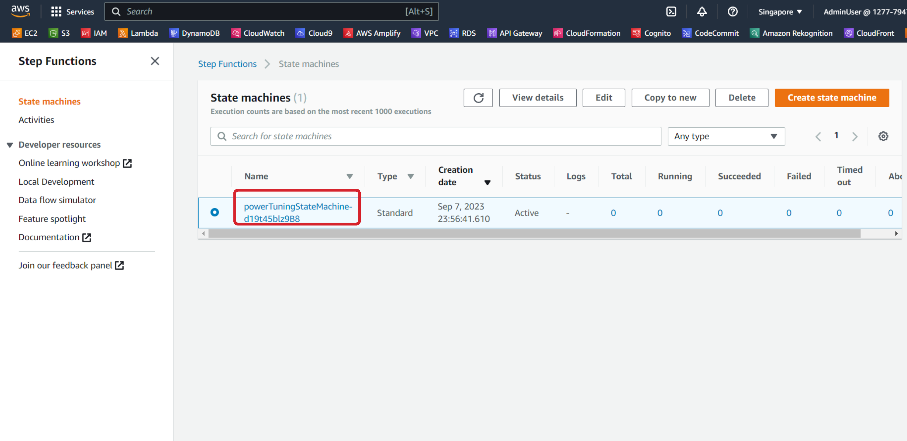
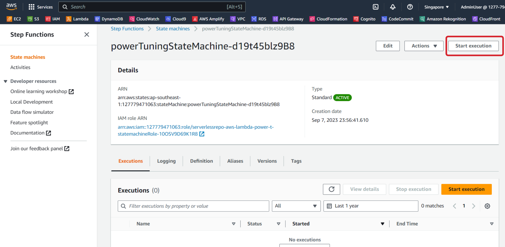
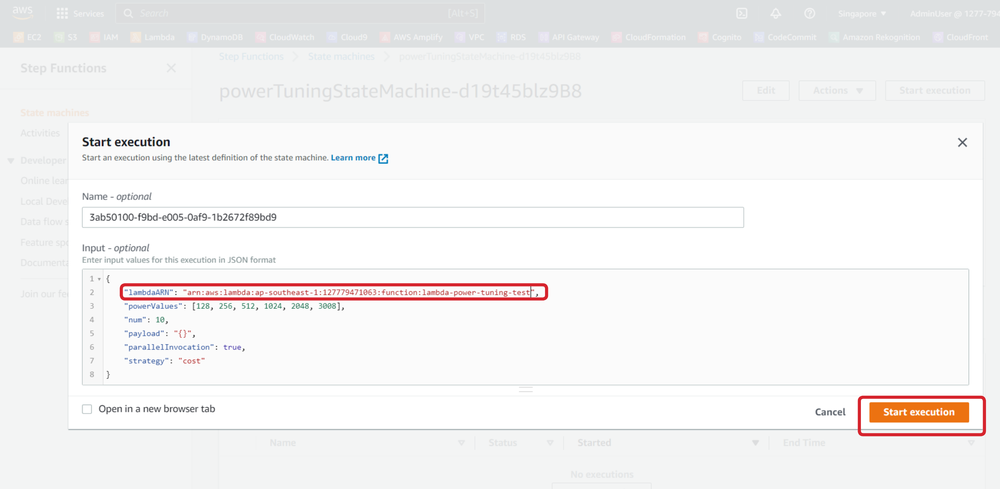
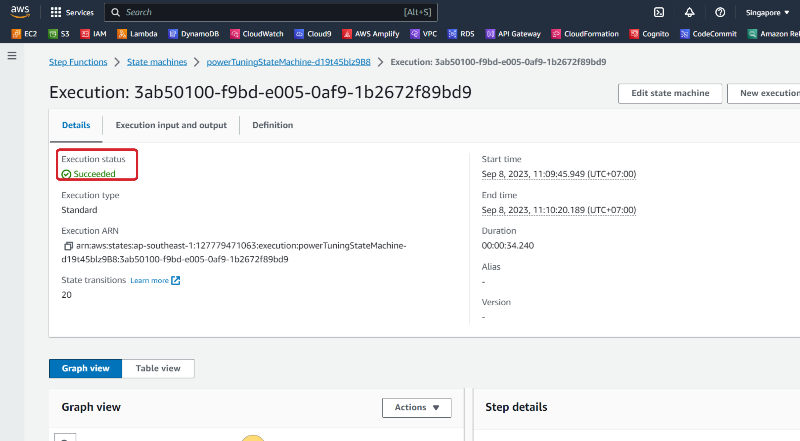
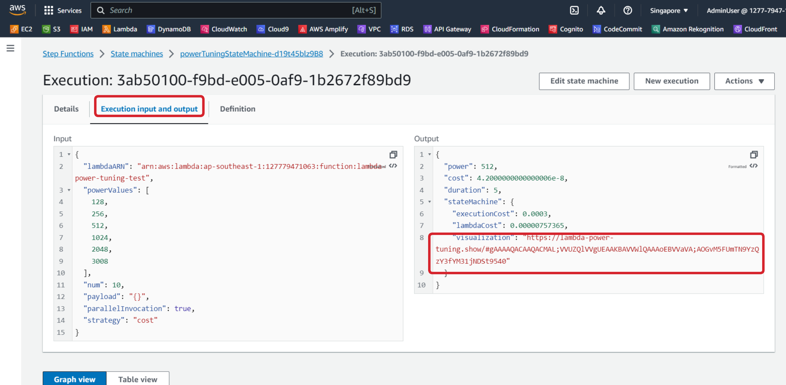
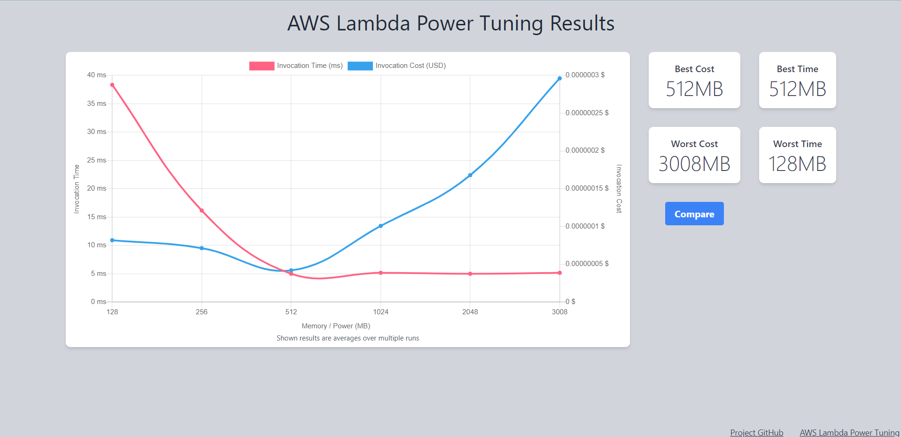

Bây giờ bạn đã deploy power tuning tool và test Lambda function. Đây là lúc tìm ra memory size tốt nhất cho function này. Power Tuning Tool sẽ chạy function của chúng ta với nhiều memory size khác nhau để giúp xác định cấu hình nào tốt nhất cho chi phí và hiệu năng. Trong phần này, chúng ta sẽ đi qua các bước để phân tích cấu hình của function chúng ta.

Đầu tiên, các bạn hãy vào [Step Function console](https://console.aws.amazon.com/states/). Ở thanh bên trái, hãy chọn **State machines**. Ở đây chúng ta sẽ thấy state machine mà các bạn đã tạo ra ở phần trước. Click vào state machine đó. 



Copy đoạn script dưới đây.

```
{
	"lambdaARN": "YOUR LAMBDA ARN HERE",
	"powerValues": [128, 256, 512, 1024, 2048, 3008],
	"num": 10,
	"payload": "{}",
	"parallelInvocation": true,
	"strategy": "cost"
}
```

Ở trang **powerTuningStateMachine** vừa mở ra, các bạn hãy click vào **Start execution** ở góc phải trên cùng.



Khi trang **Start execution** mở ra, hãy paste đoạn script ở trên vào phần **Input - optional** và thay thế **YOUR LAMBDA ARN HERE** bằng ARN của Lambda function mà các bạn đã tạo ra ở phần trước. Sau đó, click vào nút **Start execution** ở cuối trang.



Chờ đến khi execution hoàn thành, các bạn sẽ thấy **Execution status** với giá trị là **Succeeded**.



Tiếp theo, các bạn hãy chọn phần **Execution input and output**. Các bạn sẽ thấy ở phần output có URL ở **visualization** field. Copy URL đó.



Hãy mở trình duyệt mới (Google, CocCoc, Microsoft Edge, etc) và paste URL đó vào. Các bạn sẽ nhận được như hình dưới đây.



Từ bảng phân tích ở trên, các bạn có thể kết luận rằng để tối ưu hóa function với chi phí thấp nhất, cấu hình memory 512MB sẽ là tốt nhất. Để tối ưu hóa function về hiệu suất (tức là thời gian thực thi ngắn nhất), cấu hình memory 512MB sẽ là tốt nhất.

Nếu function ban đầu được cấu hình là 128MB thì việc tăng memory lên 512MB có thể giảm chi phí và cải thiện hiệu suất. Việc tăng memory lên trên 2048MB không làm giảm thời gian thực thi và do đó chỉ dẫn đến chi phí cao. Điều này cho thấy tầm quan trọng của việc tối ưu hóa các Lambda function trong môi trường của bạn.

Workshop này minh họa sự cân bằng giữa chi phí và hiệu suất khi tạo và thực thi các Lambda function. Lambda Tuning có thể được sử dụng để đánh giá các yêu cầu cho resource và phân tích cost profile. Ứng dụng Power Tuning sẽ được sử dụng trong module Gravition để phân tích hiệu suất của function trên các compute architectures khác.