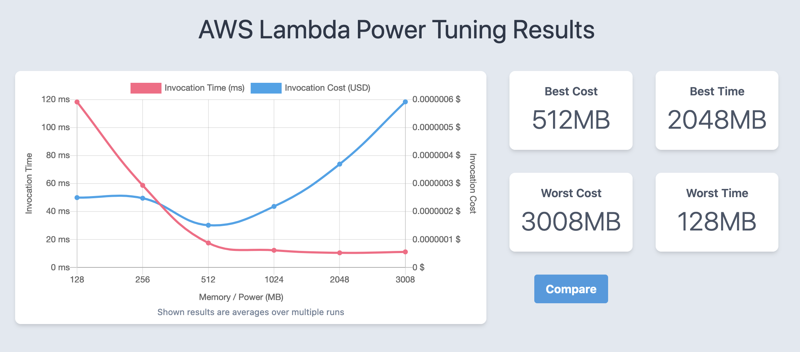

Mục tiêu của bài workshop này là tìm hiểu và hiểu rõ hơn về các AWS Lambda functions trong quá trình development. Hiểu cụ thể cách cấu hình các resource cho một Lambda function nhất định để tối ưu hóa chi phí và hiệu suất. Mục đích là để hiểu thời gian thực thi sẽ thay đổi như thế nào bằng cách tăng hoặc giảm bộ nhớ được phân bổ cho các Lambda function.

Bài workshop này sẽ dùng **Lambda Power Tuning Project** được tạo ra bởi **Alex Casalboni**. Project nằm ở [Serverless Application Repository](https://serverlessrepo.aws.amazon.com/applications/us-east-1/451282441545/aws-lambda-power-tuning).

#### Chi tiết về loại tool này

- Nó giúp bạn điều chỉnh việc phân bổ bộ nhớ cho phù hợp với bất kì Lambda function nào được triển khai trong account của bạn.

- AWS Lambda Power Tuning Tool là một state machine được hổ trợ bởi AWS Step Functions, giúp bạn tối ưu hóa các Lambda functions về chi phí và/hoặc hiệu suất bằng cách dựa vào dữ liệu.

- State machine được thiết kế để dễ deploy và thực thi nhanh chóng. Ngoài ra, đó là ngôn ngữ agnostic nên bạn có thể tối ưu hóa mọi Lambda function trong account của bạn.

- Bạn cung cấp ARN của Lambda function làm input và state machine sẽ gọi function đó với nhiều cấu hình khác nhau (từ 128MB đến 3GB). Sau đó, nó sẽ phân tích tất cả các logs khi thực thi và đưa ra đề xuất về cấu hình nguồn tốt nhất để giảm thiếu chi phí và/hoặc tối đa hóa hiệu suất.

