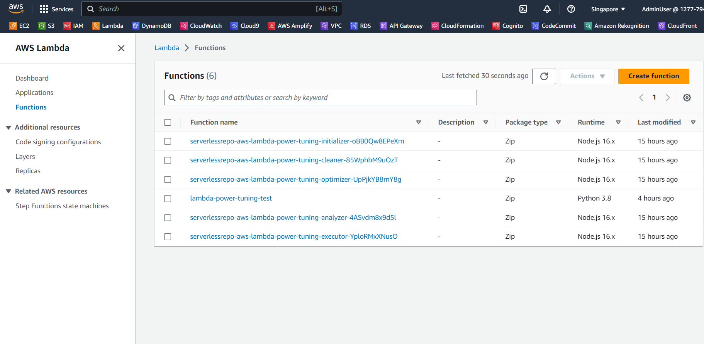

Trong phần này, bạn sẽ deploy Lambda function có chi phí tính toán cao được viết bằng Python 3.9. Function xác định số lượng số nguyên tố trong khoảng từ 0 đến 10 triệu. Function này được thực hiện ở [bài blog Lambda Graviton2](https://aws.amazon.com/blogs/aws/aws-lambda-functions-powered-by-aws-graviton2-processor-run-your-functions-on-arm-and-get-up-to-34-better-price-performance/).

{}
Hãy đảm bảo bạn đang deploy function cùng region với Lambda Power Tuning Tool.
{}

#### Deploy x86 Lambda Function

Đầu tiên, hãy vào [Lambda Console](https://console.aws.amazon.com/lambda). Ở thanh bên trái, chọn **Functions**, sau đó click vào nút **Create function**.



Ở trang **Create function**, hãy chọn **Author from scratch**. Đặt tên cho **Function name** là **lambda-base-function**. Chọn **Python 3.9** ở **Runtime** và **Architecture** là **x86_64**. Cuối cùng là click vào nút **Create function**.


Copy đoạn code dưới đây.

```
import json
import math
import platform
import timeit

def primes_up_to(n):
    primes = []
    for i in range(2, n+1):
        is_prime = True
        sqrt_i = math.isqrt(i)
        for p in primes:
            if p > sqrt_i:
                break
            if i % p == 0:
                is_prime = False
                break
        if is_prime:
            primes.append(i)
    return primes

def lambda_handler(event, context):
    start_time = timeit.default_timer()
    N = 1000000
    primes = primes_up_to(N)
    stop_time = timeit.default_timer()
    elapsed_time = stop_time - start_time

    response = {
        'machine': platform.machine(),
        'elapsed': elapsed_time,
        'message': 'There are {} prime numbers <= {}'.format(len(primes), N)
    }

    return {
        'statusCode': 200,
        'body': json.dumps(response)
    }
```

Python Lambda function này tính toán các số nguyên tố lên đến giới hạn **N** được chỉ định và đo thời gian cần thiết để thực hiện phép tính này. Cùng đi qua từng phần của đoạn code:

1. **Import Statements**:
- **json**: Thư viện này cho phép làm việc với JSON data.
- **math**: Thư viện này cho phép làm việc với các hàm toán học.
- **platform**: Thư viện này cho phép truy cập vào các thông tin về hệ điều hành, máy chủ và phiên bản Python.
- **timeit**: Thư viện này cho phép đo thời gian thực thi của một đoạn code.

2. **primes_up_to** function:
- Function này tính toán các số nguyên tố lên đến giới hạn **n**.
- Nó khởi tạo danh sách trống **primes** để chứa các số nguyên tốt.
- Nó lặp qua các số từ 2 đến **n**.
- Với mỗi số **i**, nó kiểm tra xem có phải số nguyên tố hay không bằng cách chia nó cho tất cả các số nguyên tố tìm được trước đó cho đén căn bậc hai của **i**. Nếu **i** chia hết cho bất kì số nguyên tố nào trong số này thì đó không phải là số nguyên tố và vòng lặp liên tục. Ngược lại, **i** được coi là số nguyên tố và được thêm vào danh sách **primes**.
- Function này sẽ trả về danh sách các số nguyên tố được tìm thấy.

3. **lambda_handler** function:
- Đây là Lambda function chính nó sẽ thực thi khi Lambda được trigger.
- Nó sẽ đo thời gian bắt đầu thực thi của function bằng cách sử dụng **timeit.default_timer()**.
- Nó set giá trị của **N** là 1000000, dùng để tìm tất cả các số nguyên tố lên đến 1000000.
- Nó gọi **primes_up_to** function để tìm tất cả các số nguyên tố lên đến **N**.
- Nó sẽ đo thời gian kết thúc thực thi của function bằng cách sử dụng **timeit.default_timer()**.
- Nó gồm response JSON bao gồm:
    - **machine**: loại máy hoặc môi trường hosting
    - **elapsed**: thời gian thực thi của function
    - **message**: số lượng số nguyên tố được tìm thấy

4. **Return Statement**:
- Nó trả về response JSON với **statusCode** là 200 và **body** là response JSON.
- **body** của response bao gồm dữ liệu JSON được generate trong **response** dictionary.

Tóm lại, Lambda function này tính toán các số nguyên tố lên đến giới hạn **N** (trong trường hợp này **N=1000000**), đo thời gian thực thi phép tính toán và cung cấp thông tin về máy chủ. Đây là một ví dụ đơn giản sử dụng Lambda để biểu diễn tác vụ tính toán và báo cáo kết quả.

Sau khi copy đoạn code trên, vào trang **lambda-base-function**, paste đoạn code đó vào file **lambda_function.py**.
