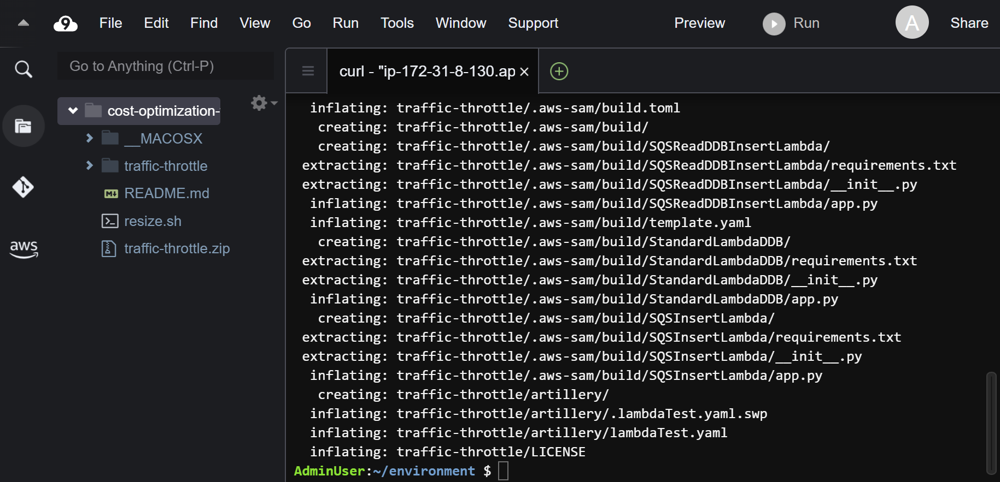
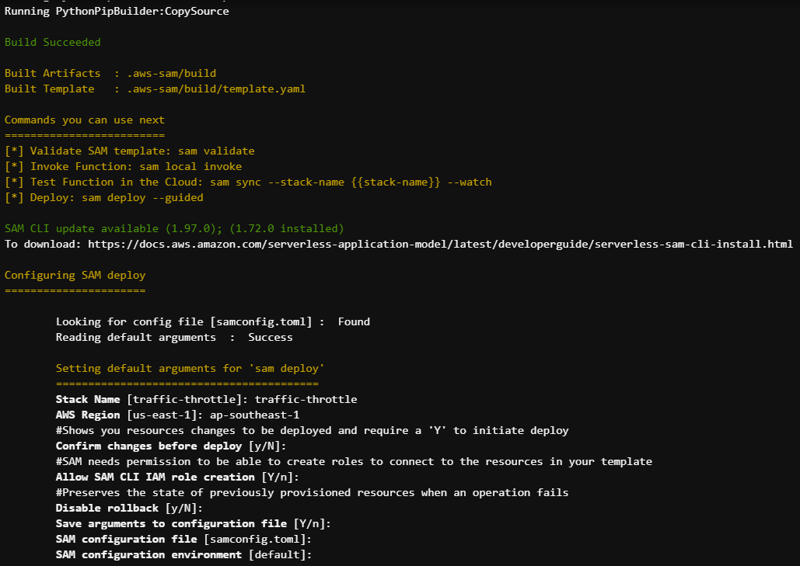

Đầu tiên, ở **Cloud9 workspace** của các bạn, di chuyển vào **environment**.

```
cd ~/environment/
```

Dùng câu lệnh dưới đây để download code artifact.

```
curl 'https://static.us-east-1.prod.workshops.aws/public/9cac7f06-a925-4a51-99f6-38ec4fb8707c/static/code/traffic-throttle.zip' -o traffic-throttle.zip && unzip traffic-throttle.zip
```

Sau khi download, các bạn sẽ thấy một thư mục mới có tên là **traffic-throttle**.



Di chuyển vào thư mục này.

```
cd traffic-throttle
```

Tiếp theo, các bạn sẽ package và deploy SAM application bằng câu lệnh:

```
sam build && sam deploy --guided
```

- **Stack Name**: traffic-throttle
- **AWS Region**: ap-southeast-1
- **Confirm changes before deploy [y/N]**: default
- **Allow SAM CLI IAM role creation [Y/n]**: default
- **Disable rollback**: default
- **Save arguments to configuration file [Y/n]**: default
- **SAM configuration file [samconfig.toml]**: default
- **SAM configuration environment [default]**: default



Sau khi deploy thành công, chúng ta sẽ nhận được dòng xác nhận như dưới đây.

```
Successfully created/updated stack - traffic-throttle in ap-southeast-1
```


