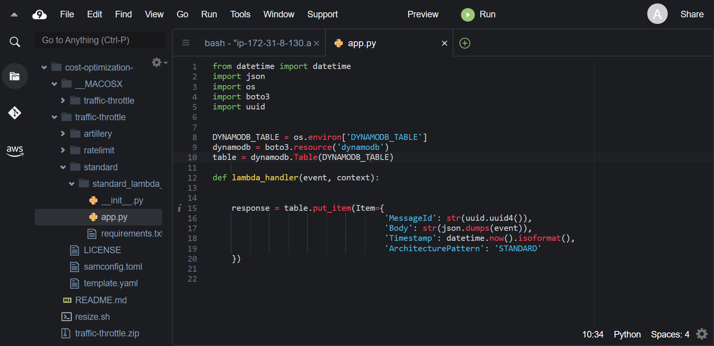

Trong phần trước, các bạn đã deploy hai architecture đơn giản riêng biệt. Architecture đầu tiên không implement rate limiting nào. Client gọi trực tiếp Lambda function để insert payload vào bảng DynamoDB. Vì không imlement rate limiting nên DynamoDB sẽ vượt quá công suất được cung cấp khi chịu tải nặng.

Chúng ta sẽ khám phá code trong Cloud9 một lát. Đầu tiên, hãy vào thư mục **traffic-throttle > standard > standard_lambda_ddb** và mở file **app.py**. Nhìn vào sẽ thấy Lambda function dùng để insert payload vào bảng DynamoDB.

Ở phần sau, chúng ta sẽ sử dụng công cụ load generating để minh họa cách architecture này hoạt động dưới tải.

