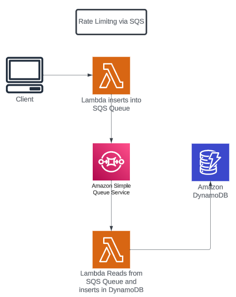
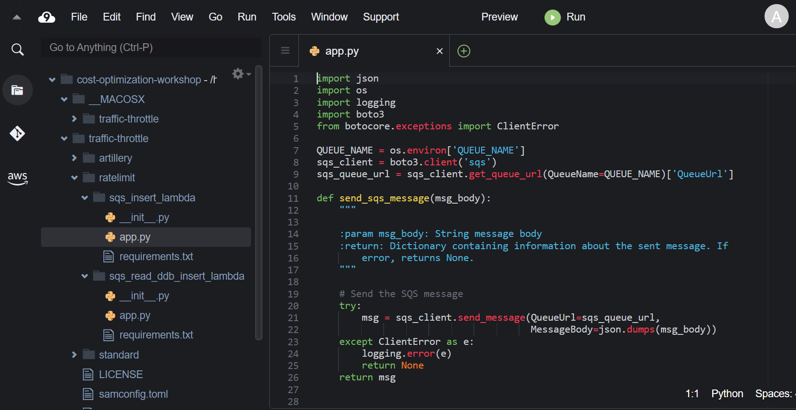
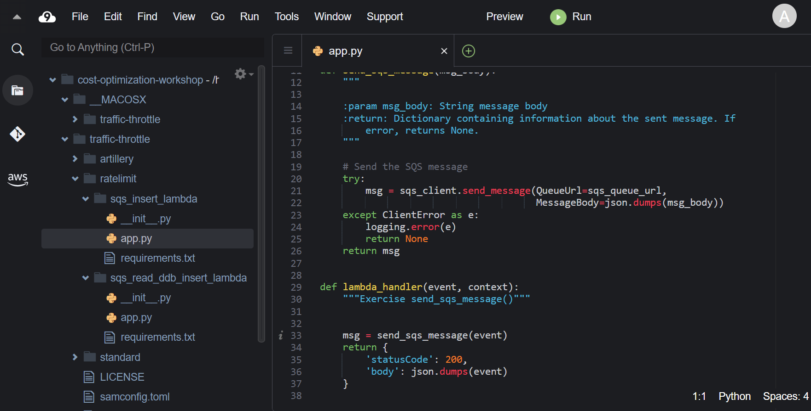
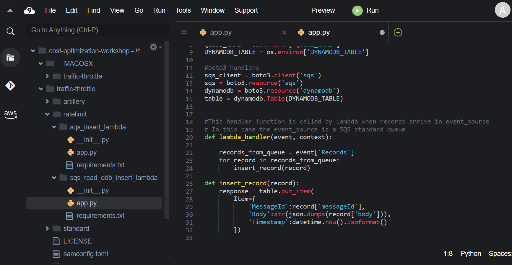

Architecture thứ hai được deploy có rate limiting được implement bằng SQS Queue. Trong architecture này, client sẽ gọi Lambda function đầu tiên có payload. Lambda function này insert record vào SQS Queue. Lambda function thứ hai sẽ đọc một số lượng message cố định trên mỗi nhóm từ queue và insert chúng vào bảng DynamoDB. Vì chúng ta đang kiểm soát số lượng message trong nhóm nên thông lượng do DynamoDB cung cấp (WCU & RCU) sẽ không bị vượt quá.

Client sẽ request đến Lambda function. Lambda function này insert payload vào SQS Queue. Lambda function thứ hai đọc một lượng messages cố định trong một nhóm và insert những items đó vào bảng DynamoDB.

#### Review architecture đã deploy

Trong Cloud9 workspace, các bạn vào thư mục **traffic-throttle > ratelimit folder**. Ở đây, các bạn sẽ thấy 2 thư mục có code của Lambda function: **sqs_insert_lambda** và **sqs_read_ddb_insert_lambda**.

Nhìn vào file **app.py** trong thư mục **sqs_insert_lambda**. Các bạn sẽ thấy function gửi payload vào SQS Queue.

Lambda function thứ 2, trong thư mục **sqs_read_ddb_insert_lambda**, mở file **app.py**, các bạn sẽ thấy function xử lí messages trong batch, gửi payload vào bảng DynamoDB.

Ở phần sau, chúng ta sẽ sủ dụng load generating tool để minh họa cách architecture này hoạt động dưới tải.

