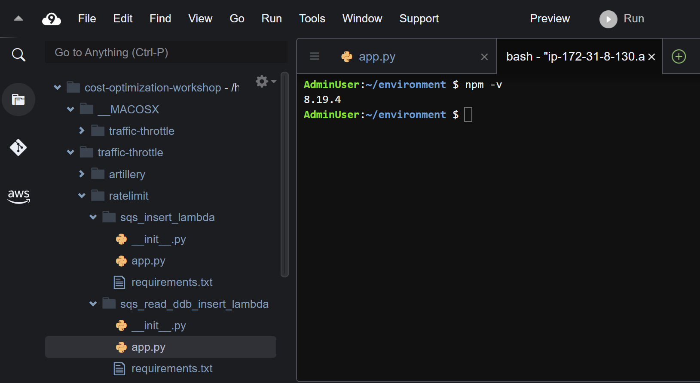
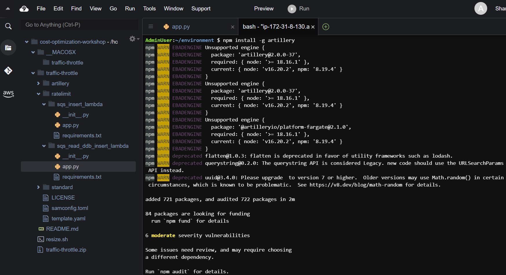
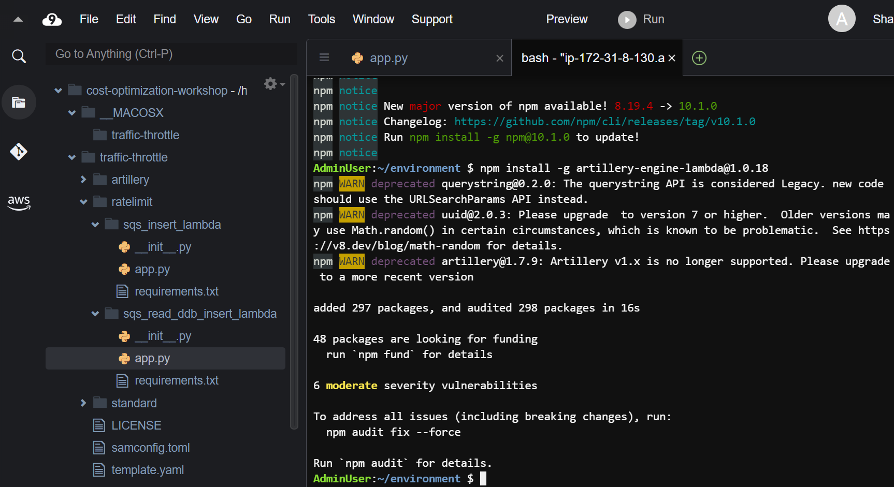
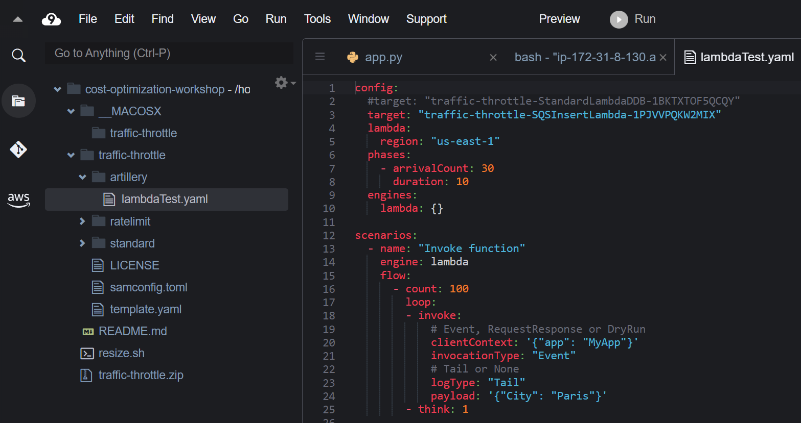
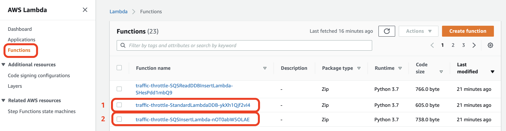
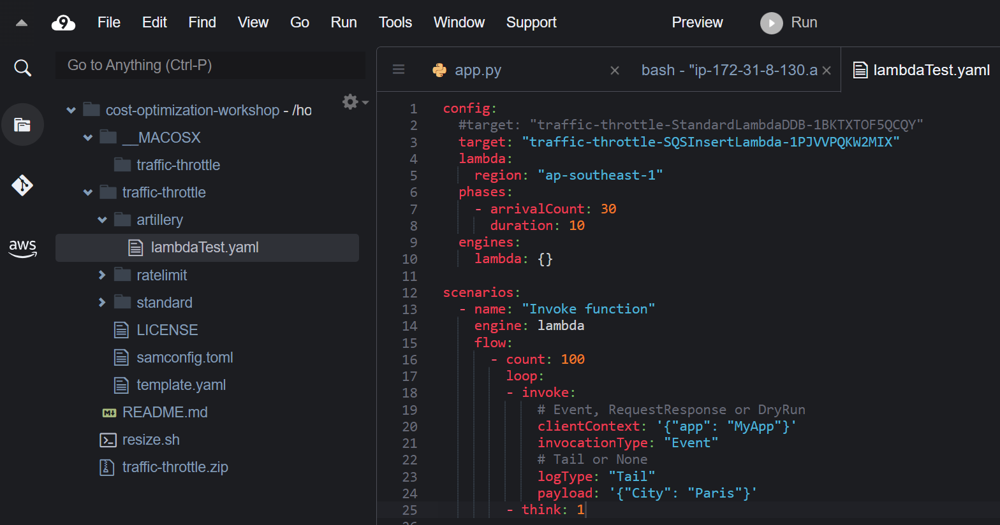

#### Test Client - Artillery Installation

Để generate load trên hai architecture mới được deploy, các bạn sẽ sử dụng công cụ distributed load testing [Artillery.io](https://artillery.io/). Các bước sau đây sẽ hướng dẫn bạn cách cài đặt và sử dụng công cụ này trong Cloud9 environment.

Đầu tiên, các bạn sẽ kiểm tra npm được cài đặt hay chưa bằng câu lệnh `npm -v` trên terminal của Cloud9. Nếu các bạn chưa cài đặt thì hãy cài đặt cả node và npm. Hãy làm theo [hướng dẫn](https://nodejs.org/en/) để cài đặt node và npm cho hệ thống của bạn.

```
npm -v
```

Nếu npm đã được cài đặt, các bạn sẽ thấy output như hình.



Tiếp theo,

Trong phần này, bạn sẽ sửa đổi Lambda function từ phần trước để deploy architecture dựa trên Graviton2 Arm-based thay vì x86 architecture

#### Deploy Graviton2 arm_64 Lambda Function

Đầu tiên chúng ta cần vào lại Console của Lambda Function được tạo ở bước trước.


Cuộn xuống ở phần **Runtime settings**, click vào nút Edit.



Ở trang **Edit runtime settings**, chúng ta chọn architecture **arm64**. Sau đó click vào nút **Save**.



Bây giờ, click vào nút **Test** và chúng ta nhận được output như hình.



#### Thu nhập Metrics từ Lambda Power Tunning Tool

Copy ARN của Lambda function **lambda-base-function**. Quay lại bước trước, chúng ta thay thế **lambdaARN** trong đoạn script bằng ARN vừa copy của Lambda function này. Sau đó click vào nút **Start execution** ở cuối trang.



Sau khi lấy URL của output, chúng ta sẽ được như hình.



#### So sánh các số liệu hiệu suất của mỗi function

Để so sánh kết quả giữa hai architecture, click vào nút **Compare** ở trong trình duyệt.


Điều thông tin bao gồm **Name for function** và **Visualization URL of function**.


Bây giờ, bạn có thể xem kết quả so sánh của cả Invocation Time và Cost giữ x86 và arm64 architecture function. Quan sát arm64 function thể hiện tốt hơn cả về Cost và Invocation Time trong trường hợp này.


Bạn có thể làm theo các bước này để so sánh giá/hiệu suất của Lambda function code của riêng bạn. Tùy thuộc vào workload, có thể chỉ thấy sự cải thiện về giá chứ không thấy sự cải thiện về hiệu suất. Trong trường hợp này, các bạn nên tận dụng các instrumentation và observability như [AWS X-Ray](https://aws.amazon.com/xray/) để xác định bottleneck. Trong nhiều trường hợp, các dependencies của function yêu cầu update chứ không phải chính code của function.

{}
**Trước khi migrate functions của bạn sang Graviton2**

Để biết thêm hướng dẫn về cách truyển workload hiện có sang Graviton2, hãy truy cập vào [AWS Graviton Githuv Repo khi chuyển workload sang trang Amazon EC2 instance dựa trên AWS Graviton2](https://github.com/aws/aws-graviton-getting-started/blob/main/transition-guide.md). Hãy luôn kiểm tra trước khi thực hiện thay đổi production workload!
{}


