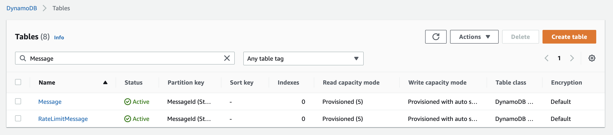
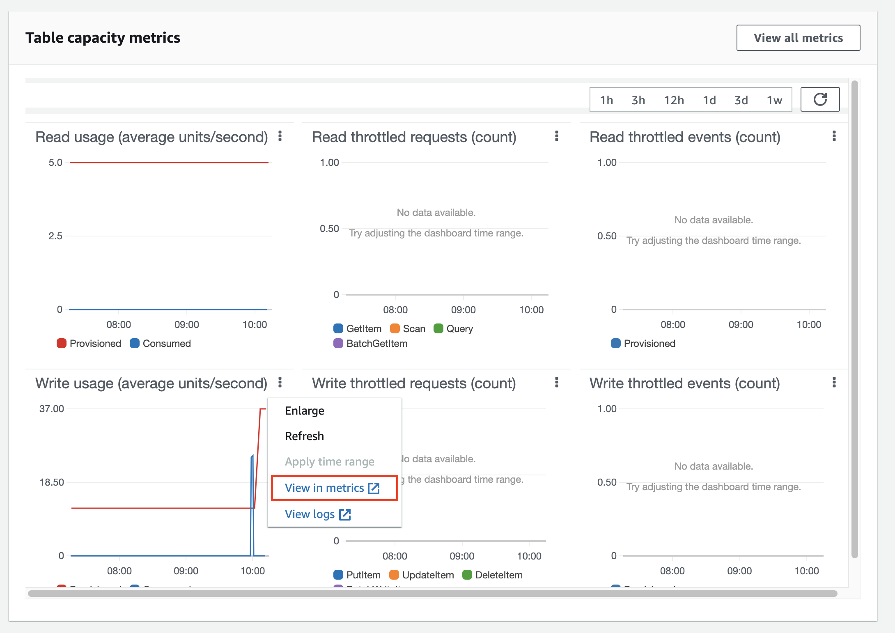
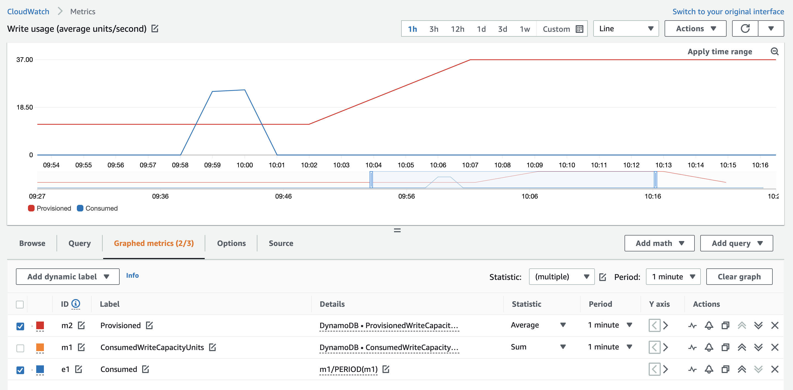
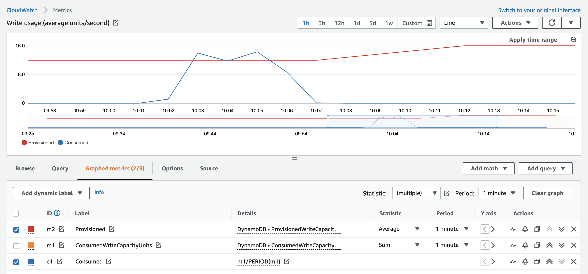

#### DynamoDB Metrics

Bây giờ, chúng ta chạy load test và có thể kiểm tra write metrics của DynamoDB CloudWatch để quan sát sự khác biệt giữa hai solutions.

Đầu tiên hãy vào [DynamoDB Console](https://console.aws.amazon.com/dynamodbv2/home#tables) để xem hai tables. Tale **Message** được sử dụng bởi function **traffic-throttle-StandardLambdaDDB** và table **RateLimitMessage** được sử dụng bởi rate limiting **traffic-throttle-SQSReadDDBInsertLambda** (tức là function consume messages từ SQS Queue).

Click vào table **Message** và xuống phần **Overview** ở mục **Table capacity metrics** được show bởi **CloudWatch graphs**. Ở biểu đồ **Write usage (average units/second)** click vào menu và chọn **view in metrics** để xem trong CloudWatch.

Ở biểu đồ trong CloudWatch, các bạn sẽ thấy consumed capacity units vượt quá mức cung cấp. Cái này sẽ xảy ra vì không có rate limiting nào được áp dụng cho Lambda function này. Kết quả là việc [auto sclaing của DynamoDB](https://aws.amazon.com/blogs/aws/new-auto-scaling-for-amazon-dynamodb/) đã tăng Write Capacity Units (WCU) từ **12 lên 37**.

Bây giờ hãy lặp lại quy trình tương tự để xem biểu đồ của DynamoDB table **RateLimitMessage**. Bạn sẽ thấy rằng consumed capacity không vượt quá giới hạn dung lượng được cung cấp. Do đó khả năng auto scaling do DynamoDB thực hiện ít biết động hơn khi chỉ tăng từ **12 lên 16**.    

#### Tổng kết

Giải pháp Rate Limiting là một giải pháp rẻ hơn, đặc biệt khi lưu lượng truy cập vào giờ cao điểm không liên lục và xảy ra hầu như hàng giờ. Rate Limiting hạn chế DynamoDB mở rộng quy mô resource để bù đắp chi phí của Lambda function bổ sung và SQS Queue. Pattern này cũng mang lại modularity, tách rời người tạo tin nhắn khỏi người tiêu dụng tin nhắn.

{}
Giải pháp này không giảm chi phí cho tất cả các loại request patterns.
{}

