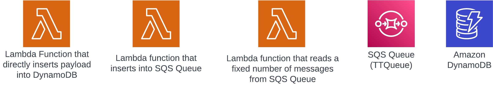
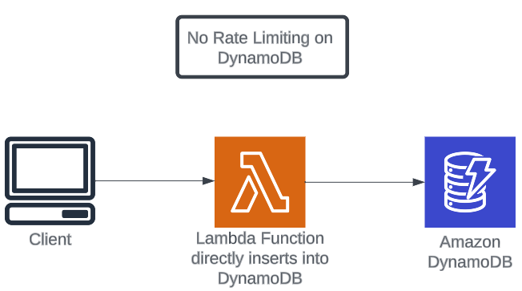

#### Tổng quát

Trong phần này, các bạn sẽ deploy hai architecture để mô tả throttling ở level DynamoDB resource.

Ở architecture đầu tiên, client sẽ tương tác với lambda function. Lambda function này trực tiếp insert payload vào bảng DynamoDB. Khi lưu lượng truy cập vào Lambda function tăng lên, DynamoDB sẽ tiêu thụ nhiều hơn kahr năng được cung cấp. Các bạn sẽ thấy một số throttled requests ở DynamoDB level.

Architecture thứ hai triển khai throttling qua SQS Queue. Có hai Lambda function trong architecture này. Lambda functions đầu tiên sẽ insert vào SQS Queue. Lambda function thứ hai truy xuất một loạt messages cố định và insert chúng vào DynamoDB. Lambda function thứ hai control số lượng messages sẽ được xử lí (throttle). Cái này cho phép chúng ta control các resource mà DynamoDB (WCY và RCU) tiêu thụ và do đó tránh được throttling.

