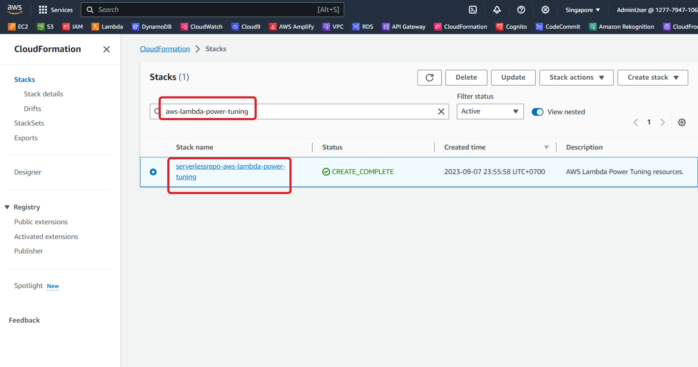
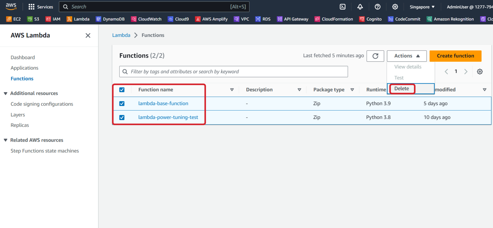

#### Lambda Power Tuning Tool

Các bạn hãy vào [CloudFormation Console](https://us-east-1.console.aws.amazon.com/cloudformation/home?region=us-east-1#/stacks?filteringText=&filteringStatus=active&viewNested=true). Tìm kiếm từ khóa **aws-lambda-power-tuning** và chọn stack đó. Sau đó click vào nút **Delete**.



#### Test Lambda Function

Các bạn hãy vào [Lambda Console](https://console.aws.amazon.com/lambda). Chọn function mà các bạn tạo trước đó. Sau đó click vào nút **Actions** và chọn **Delete**.



#### SAM

Ở terminal của Cloud9, hãy di chuyển vào thư mục **traffic-throttle**.

```
cd ~/environment/traffic-throttle/
```

Sau đó xóa bằng câu lệnh dưới đây.

```
sam delete --stack-name traffic-throttle --no-prompts
```

Sẽ mất vài phút để xóa. Các bạn có thể xem quá trình xóa ở [CloudFormation Console](https://console.aws.amazon.com/cloudformation).
